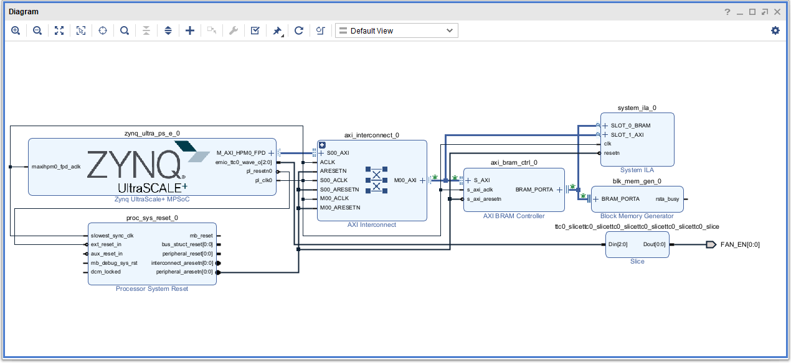

PLBRAM-Kv260
=======================================================================

This Repository provides example for uiomem and ZynqMP-FPGA-Linux.

## Requirement

 * Board: Kv260
 * OS:
   - ZynqMP-FPGA-Ubuntu22.04-Desktop
     + v1.2.0 https://github.com/ikwzm/ZynqMP-FPGA-Ubuntu22.04-Desktop/tree/v1.2.0
   - ZynqMP-FPGA-Debian12
     + v1.0.0 https://github.com/ikwzm/ZynqMP-FPGA-Debian12/tree/v1.0.0
   - ZynqMP-FPGA-Debian13
     + v3.1.0 https://github.com/ikwzm/ZynqMP-FPGA-Debian13/tree/v3.1.0
 * uiomem (v1.1.0-beta.1) https://github.com/ikwzm/uiomem/tree/1.1.0-beta.1
 * fclkcfg (v1.7.3) https://github.com/ikwzm/fclkcfg/tree/v1.7.3

## Block Design



## Boot Kv260 and login fpga user

fpga'password is "fpga".

```console
debian-fpga login: fpga
Password:
fpga@debian-fpga:~$
```

## Download this repository

### Download this repository

```console
fpga@debian-fpga:~$ mkdir work
fpga@debian-fpga:~$ cd work
fpga@debian-fpga:~/work$ git clone https://github.com/ikwzm/PLBRAM-Kv260
Cloning into 'PLBRAM-Kv260'...
remote: Enumerating objects: 30, done.
remote: Counting objects: 100% (30/30), done.
remote: Compressing objects: 100% (22/22), done.
remote: Total 30 (delta 7), reused 30 (delta 7), pack-reused 0
Unpacking objects: 100% (30/30), done.
fpga@debian-fpga:~/work$ cd PLBRAM-Kv260
```

## Setup

### Build uiomem and uiomem-test

#### Update submodules

```console
fpga@debian-fpga:~/work/PLBRAM-Kv260$ git submodule init
Submodule 'uiomem' (https://github.com/ikwzm/uiomem) registered for path 'uiomem'
Submodule 'uiomem-test' (http://github.com/ikwzm/uiomem-test.git) registered for path 'uiomem-test'
fpga@debian-fpga:~/work/PLBRAM-Kv260$ git submodule update
Cloning into '/home/fpga/work/tmp/PLBRAM-Kv260/uiomem'...
Cloning into '/home/fpga/work/tmp/PLBRAM-Kv260/uiomem-test'...
warning: redirecting to https://github.com/ikwzm/uiomem-test.git/
Submodule path 'uiomem': checked out 'd9ddd8035832ea77b4cbfec69d3a4aac5893dc14'
Submodule path 'uiomem-test': checked out '9023c48045d853cc6b6202859dd00848f7949dbc'
```

#### Build uiomem kenrel module

```console
fpga@debian-fpga:~/work/PLBRAM-Kv260$ cd uiomem
fpga@debian-fpga:~/work/PLBRAM-Kv260/uiomem$ make
make -C /lib/modules/6.12.60-zynqmp-fpga-generic/build ARCH=arm64 CROSS_COMPILE= M=/home/fpga/work/tmp/PLBRAM-Kv260/uiomem CONFIG_UIOMEM=m modules
make[1]: Entering directory '/usr/src/linux-headers-6.12.60-zynqmp-fpga-generic'
warning: the compiler differs from the one used to build the kernel
  The kernel was built by: aarch64-linux-gnu-gcc (Ubuntu 13.3.0-6ubuntu2~24.04) 13.3.0
  You are using:           gcc (Debian 14.2.0-19) 14.2.0
  CC [M]  /home/fpga/work/tmp/PLBRAM-Kv260/uiomem/uiomem.o
  MODPOST /home/fpga/work/tmp/PLBRAM-Kv260/uiomem/Module.symvers
  CC [M]  /home/fpga/work/tmp/PLBRAM-Kv260/uiomem/uiomem.mod.o
  CC [M]  /home/fpga/work/tmp/PLBRAM-Kv260/uiomem/.module-common.o
  LD [M]  /home/fpga/work/tmp/PLBRAM-Kv260/uiomem/uiomem.ko
make[1]: Leaving directory '/usr/src/linux-headers-6.12.60-zynqmp-fpga-generic'
fpga@debian-fpga:~/work/PLBRAM-Kv260/uiomem$ cd ..
```

#### Build uiomem test programs

```console
fpga@debian-fpga:~/work/PLBRAM-Kv260$ cd uiomem-test
gcc -O2 -DUSE_UIOMEM_IOCTL -o uiomem-file-test uiomem-file-test.c uiomem.c
gcc -O2 -DUSE_UIOMEM_IOCTL -o uiomem-ioctl-test uiomem-ioctl-test.c
gcc -O2 -DUSE_UIOMEM_IOCTL -o uiomem-throughput-test uiomem-throughput-test.c uiomem.c
fpga@debian-fpga:~/work/PLBRAM-Kv260/uiomem$ cd ..
```

### Load uiomem

```console
fpga@debian-fpga:~/work/PLBRAM-Kv260$ sudo insmod uiomem/uiomem.ko
```

### Load FPGA and Device Tree

```console
fpga@debian-fpga:~/work/PLBRAM-Kv260$ sudo rake install
gzip -d -f -c plbram_256k_dbg.bin.gz > /lib/firmware/plbram_256k_dbg.bin
./dtbo-config --install plbram_256k --dts plbram_256k_dbg.dts
<stdin>:35.18-39.20: Warning (unit_address_vs_reg): /fragment@2/__overlay__/uiomem_plbram: node has a reg or ranges property, but no unit name
<stdin>:26.13-41.5: Warning (avoid_unnecessary_addr_size): /fragment@2: unnecessary #address-cells/#size-cells without "ranges" or child "reg" property
```

```console
fpga@debian-fpga:~/work/PLBRAM-Kv260$ dmesg | tail -21
[ 1462.228582] fpga_manager fpga0: writing plbram_256k_dbg.bin to Xilinx ZynqMP FPGA Manager
[ 1464.263186] OF: overlay: WARNING: memory leak will occur if overlay removed, property: /fpga-region/firmware-name
[ 1464.275493] uiomem uiomem0: driver version = 1.1.0-beta.1
[ 1464.280916] uiomem uiomem0: ioctl version  = 1
[ 1464.285414] uiomem uiomem0: major number   = 236
[ 1464.290084] uiomem uiomem0: minor number   = 0
[ 1464.294544] uiomem uiomem0: range address  = 0x0000000400000000
[ 1464.300468] uiomem uiomem0: range size     = 262144
[ 1464.305350] uiomem uiomem0: cached         = 1
[ 1464.309798] uiomem uiomem0: coherent       = 0
[ 1464.314244] uiomem uiomem0: sync_operation = ARM64 Native
[ 1464.319648] uiomem uiomem0: shareable      = 0
[ 1464.324116] uiomem 400000000.uiomem_plbram: driver installed.
[ 1464.398800] fclkcfg axi:fclk0: driver version : 1.9.1
[ 1464.403895] fclkcfg axi:fclk0: device name    : axi:fclk0
[ 1464.409300] fclkcfg axi:fclk0: clock  name    : pl0_ref
[ 1464.414533] fclkcfg axi:fclk0: clock  rate    : 99999999
[ 1464.419937] fclkcfg axi:fclk0: clock  enabled : 1
[ 1464.424647] fclkcfg axi:fclk0: remove rate    : 1000000
[ 1464.429878] fclkcfg axi:fclk0: remove enable  : 0
[ 1464.434588] fclkcfg axi:fclk0: driver installed.
```

## Run uiomem-file-test

```console
fpga@debian-fpga:~/work/PLBRAM-Kv260$ sudo ./uiomem-test/uiomem-file-test
device=uiomem0
driver_version=1.1.0-beta.1
sync_operation=ARM64 Native
ioctl_version=1
size=262144
shareable=0
cached=1
coherent=0
mmap write test : sync=1 time=0.000542 sec (0.000542 sec)
mmap read  test : sync=1 time=0.002514 sec (0.002514 sec)
compare = ok
mmap write test : sync=0 time=0.000494 sec (0.000242 sec)
mmap read  test : sync=1 time=0.002254 sec (0.002254 sec)
compare = ok
mmap write test : sync=1 time=0.000545 sec (0.000545 sec)
mmap read  test : sync=0 time=0.000336 sec (0.000295 sec)
compare = ok
mmap write test : sync=0 time=0.000444 sec (0.000203 sec)
mmap read  test : sync=0 time=0.000331 sec (0.000296 sec)
compare = ok
file write test : sync=1 time=0.000275 sec (0.000275 sec)
mmap read  test : sync=0 time=0.000333 sec (0.000295 sec)
compare = ok
file write test : sync=0 time=0.000287 sec (0.000266 sec)
mmap read  test : sync=0 time=0.000418 sec (0.000382 sec)
compare = ok
mmap write test : sync=0 time=0.000457 sec (0.000213 sec)
file read  test : sync=1 time=0.000329 sec (0.000329 sec)
compare = ok
mmap write test : sync=0 time=0.000437 sec (0.000198 sec)
file read  test : sync=0 time=0.000363 sec (0.000329 sec)
compare = ok
```

## Run uiomem-throughput-test

* sync=0: mmap is cacheable, and cache synchronization is performed before and after each access.
* sync=1: mmap is non-cacheable, and cache synchronization is not performed before or after accesses.

```console
sudo ./uiomem-test/uiomem-throughput-test
device=uiomem0
driver_version=1.1.0-beta.1
sync_operation=ARM64 Native
ioctl_version=1
size=262144
shareable=0
cached=1
coherent=0
mmap write test : sync=0 throughput=939.2 MBytes/sec
mmap read  test : sync=0 throughput=787.7 MBytes/sec
mmap write test : sync=1 throughput=256.4 MBytes/sec
mmap read  test : sync=1 throughput= 46.7 MBytes/sec
```

## Clean up

```console
fpga@debian-fpga:~/work/PLBRAM-Kv260$ sudo rake uninstall
./dtbo-config --remove plbram_256k
```

```console
fpga@debian-fpga:~/work/PLBRAM-Kv260$ dmesg | tail -2
[ 1757.258747] uiomem 400000000.uiomem_plbram: driver removed.
[ 1757.268728] fclkcfg axi:fclk0: driver removed.
```

## Build Bitstream file

### Requirement

* Vivado 2023.1

### Download this repository

```console
shell$ git clone https://github.com/ikwzm/PLBRAM-Kv260
Cloning into 'PLBRAM-Kv260'...
remote: Enumerating objects: 30, done.
remote: Counting objects: 100% (30/30), done.
remote: Compressing objects: 100% (22/22), done.
remote: Total 30 (delta 7), reused 30 (delta 7), pack-reused 0
Unpacking objects: 100% (30/30), done.
```

### Create Vivado Project

```console
vivado% cd fpga
vivado% vivado -mode batch -source create_project.tcl
vivado% cd ..
```

or

```
Vivado > Tools > Run Tcl Script... > fpga/create_project.tcl
```

### Implementation

```console
vivado% cd fpga
vivado% vivado -mode batch -source implementation.tcl
vivado% cd ..
```

or

```
Vivado > Tools > Run Tcl Script... > fpga/implementation.tcl
```

### Convert from Bitstream File to Binary File

```console
vivado% cd fpga
vivado% bootgen -image plbram_256k_dbg.bif -arch zynqmp -w -o ../plbram_256k_dbg.bin
vivado% cd ..
```

### Compress plbram_256k_dbg.bin to plbram_256k_dbg.bin.gz

```console
vivado% gzip plbram_256k_dbg.bin
```

